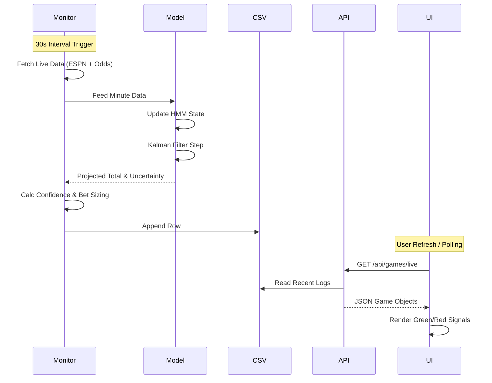

# Take The Live Under: System Architecture & Deep Dive

> [!IMPORTANT]
> This document provides a comprehensive technical overview of the "Take The Live Under" system, including its high-level architecture, data pipelines, and the proprietary "PJ Model" intelligence layer.

## 1. High-Level System Architecture

The system is a real-time distributed application composed of three main subsystems:
1.  **The Monitor (Backend Worker)**: A Python-based autonomous agent that continuously polls live game data, runs the predictive models, and logs results.
2.  **The API (Backend Server)**: A FastAPI service that exposes the processed data to the frontend and handles user authentication/administration.
3.  **The Dashboard (Frontend)**: A Next.js application providing a real-time UI for bettors to view signals and analytics.

### System Context Diagram

```mermaid
graph TD
    subgraph "External Data Sources"
        ESPN[ESPN API\n(Scores, Time, Game State)]
        OddsAPI[The Odds API\n(Live Betting Lines)]
        KenPom[KenPom / SportsDataIO\n(Pre-game Team Stats)]
    end

    subgraph "Take The Live Under System"
        direction TB
        Monitor[Monitor Agent\n(Python / monitor.py)]
        API[API Server\n(FastAPI / api/main.py)]
        Model[PJ Model Core\n(HMM + Kalman Filter)]
        
        subgraph "Data Persistence"
            CSV[(CSV Logs\n/data/*.csv)]
            Cache[(Stats Cache\n/cache/*.csv)]
        end

        UI[Frontend Dashboard\n(Next.js / Vercel)]
    end

    User((User)) -->|Views Signals| UI
    Admin((Admin)) -->|Configures Weights| UI

    Monitor -->|Polls (30s)| ESPN
    Monitor -->|Polls (30s)| OddsAPI
    Monitor -->|Fetches Daily| KenPom
    
    Monitor -->|Runs| Model
    Monitor -->|Writes| CSV
    
    API -->|Reads| CSV
    UI -->|Polls (20s)| API
```

---

## 2. The Intelligence Layer: PJ Model Deep Dive

The core differentiator of this system is its use of advanced signal processing and probabilistic modeling rather than simple linear extrapolation.

### 2.1 Hidden Markov Model (HMM) for Regime Detection
Matches are not static; they flow through different "regimes" (e.g., a defensive struggle, a shootout, a foul-fest).
*   **Purpose**: To contextualize the current pace of play.
*   **Implementation**: `GaussianHMM` from `hmm_model.py`.
*   **Features Used**: Points Per Minute (PPM), Possessions Per Minute (POSM), Fouls Per Minute, Turnovers Per Minute.
*   **Hidden States**: 
    1.  **Slow**: Methodical half-court sets.
    2.  **Normal**: Average pace.
    3.  **Fast**: Transition-heavy, quick shots.
    4.  **Foul/Endgame**: High variance, stop-clock situations.

### 2.2 Adaptive Kalman Filter
Raw scoring data is noisy. The Kalman filter smooths this noise to project the "true" underlying scoring rate.
*   **Innovation**: The filter is **Adaptive** and **Context-Aware**.
*   **Adaptive Q (Process Noise)** and **R (Measurement Noise)**:
    *   **Time-Decay**: As the game nears the end, $Q$ increases (model reacts faster to recent data) and $R$ decreases (measurements are trusted more).
    *   **Team Personalities**: Volatile teams (e.g., fast-paced 3pt shooting teams) get higher $Q$ values. Consistent teams (e.g., slow defensive teams) get lower $Q$ values.
    *   **Regime-Specific**: The filter parameters shift based on the current HMM state.

### 2.3 Confidence Scoring Algorithm
The system doesn't just output a number; it outputs a confidence interval.
The **Confidence Score (0-100)** is calculated in `betting_signals.py` based on:
1.  **Edge (40%)**: Magnitude of difference between Model Projection vs. Vegas Line.
2.  **Time (20%)**: Certainty increases as the game progresses (less variance remaining).
3.  **Covariance (20%)**: The Kalman Filter's internal uncertainty metric ($P$). Lower $P$ = data is consistent = higher confidence.
4.  **Matchup (20%)**: "Thesis-validating" matchups (e.g., two slow teams playing fast early → high confidence they will revert to mean).

---

## 3. Data Pipeline & Data Flow

The system operates on a rigorous 30-second heartbeat.

### Monitoring Loop (`monitor.py`)
1.  **Fetch Phase**:
    *   Calls **ESPN** for "authoritative" game state (Period, Clock, Score).
    *   Calls **The Odds API** for "market" state (Spread, Total, Moneyline).
2.  **Harmonization Phase**:
    *   Fuzzy matches team names between ESPN and Odds API (e.g., "UConn" vs "Connecticut").
3.  **Analysis Phase**:
    *   Calculates **Required PPM**: $\text{Required PPM} = \frac{\text{Line} - \text{Current Score}}{\text{Minutes Remaining}}$
    *   Updates **HMM**: Detects current game regime.
    *   Updates **Kalman**: Projects final score.
4.  **Signal Phase**:
    *   Triggers logic: `IF Required PPM > Threshold AND Confidence > 60 THEN Signal UNDER`.
    *   Logs entire state to `data/ncaa_live_log.csv`.



---

## 4. Frontend Application

The frontend is a **Next.js 14** application designed for speed and clarity.

### Key Components
*   **`GameCard.tsx`**: The atomic unit of the dashboard. Displays score, clock, and the critical **Required PPM** metric.
    *   *Visual Cues*: Pulses Green when `Required PPM > 4.5` (strong UNDER signal).
*   **`TrendsView.tsx`**: Visualizes the "story" of the game using Recharts.
    *   Plots *Projected Total* vs *Vegas Line* over time.
    *   Shows *Confidence* trajectory.
*   **`GameDetailModal.tsx`**: Deep dive view triggered by clicking a card.

### Technical Stack
*   **Framework**: Next.js 14 (App Router).
*   **Styling**: TailwindCSS (Dark mode optimized for battery life/night usage).
*   **State Management**: SWR (Stale-While-Revalidate) for auto-refreshing API data without boilerplate.
*   **Visualization**: Recharts for line/step charts.

---

## 5. Infrastructure & Deployment

The system is deployed using a split-host strategy to optimize for cost and reliability.

### Backend (Railway)
*   **Service**: Railway.app
*   **Process 1 (`web`)**: `uvicorn api.main:app` - Handles HTTP requests.
*   **Process 2 (`worker`)**: `python monitor.py` - Runs the infinite loop.
*   **Storage**: Ephemeral filesystem (CSV logs are persisted but not in a database). *Note: Production setups usually migrate CSVs to Postgres/SQLite, but CSV is used here for portability and speed.*

### Frontend (Vercel)
*   **Service**: Vercel
*   **Trigger**: Git push to `main`.
*   **Env Vars**: `NEXT_PUBLIC_API_URL` pointing to Railway instance.

### Configuration
*   **`config.py`**: Central source of truth.
    *   **Feature Flags**: `USE_KENPOM`, `Sport Mode` (NCAA/NBA).
    *   **Tuning**: `PPM_THRESHOLD`, `CONFIDENCE_WEIGHTS`.

---

## 6. Key Data Structures

### 6.1 The Betting Signal
The output of the `BettingSignalCalculator`. This is the "product" the system sells.
```python
@dataclass
class BettingSignal:
    game_id: str
    direction: str          # "OVER", "UNDER", "NO_PLAY"
    edge_pct: float         # e.g., 5.4% (Model vs Line)
    confidence: int         # 0-100 score
    unit_size: float        # 0.5 - 3.0 units
    reasoning: List[str]    # Explanatory text (e.g., "Late game - higher certainty")
    kalman_covariance: float # Internal uncertainty metric
```

### 6.2 The Game Object
The harmonized representation of a live game, merging ESPN and Odds API data.
```json
{
  "game_id": "401817488",
  "home_team": "Virginia",
  "away_team": "Duke",
  "period": 2,
  "minutes_remaining": 4.5,
  "home_score": 62,
  "away_score": 58,
  "ou_line": 134.5,
  "required_ppm": 3.22,  // The "Live Under" metric
  "current_ppm": 4.10,
  "trigger_flag": true,
  "confidence_score": 85,
  "unit_recommendation": 2.0
}
```

---

## 7. Extension Points

The system is designed for extensibility:
*   **New Sports**: The `SportMode` config allows switching to NBA. The logic remains the same (pace estimation), but `period` length changes (4x12m vs 2x20m).
*   **New Models**: The `PJModelIntegration` class can be swapped for other predictive models as long as they implement `get_projected_total()`.
*   **Alerting**: The `send_realtime_update` function in `monitor.py` is a hook for WebSocket updates, but can easily be extended to send **Discord** or **Telegram** notifications.
